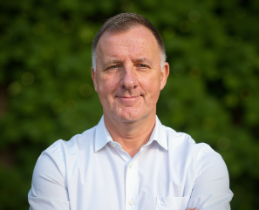
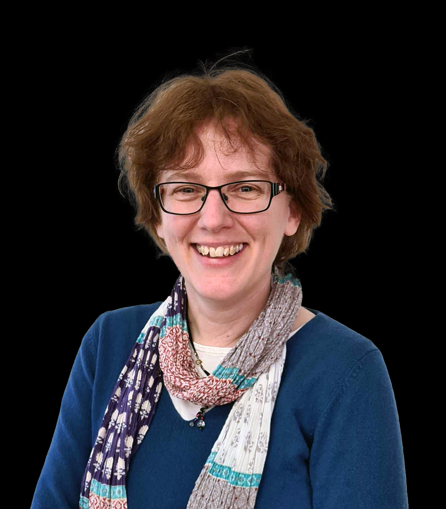

We are proud to welcome the following keynote speakers to address GISRUK 2026: 
 

:::{.grid}

::: {.g-col-3}

:::

::: {.g-col-9}
**Ed Parsons** is a Digital Geographer and a Geospatial Technology Advisor. He was Google’s Geospatial Technologist, with responsibility for evangelising Google’s mission to organise the world’s information using Geography. In this role he maintained links with Governments, Universities, Research, and Standards Organisations which were involved in the development of Geospatial Technology. Ed also lead Google’s efforts in maintaining a healthy Open Data Ecosystem to support AI in Europe. He is the Chair of the Board of Directors of the Open Geospatial Consortium and was co-chair of the W3C/OGC Spatial Data on the Web Working Group. He also represented Google at the EMTEL committee of ETSI developing geospatial solutions for emergency telecommunications. Ed is a Visiting Professor at University College London and has been an industry advisor to a number of international universities. Ed was the first Chief Technology Officer in the 200-year-old history of Ordnance Survey, and was instrumental in moving the focus of the organisation from mapping to Geographical Information. He came to the Ordnance Survey from Autodesk, where he was EMEA Applications Manager for the Geographical Information Systems (GIS) Division. He earned a Masters degree in Applied Remote Sensing from Cranfield Institute of Technology, holds a Honorary Doctorate in Science from Kingston University, London, and is a Fellow of both the Royal Geographical Society, and the Royal Institute of Navigation. In 2024 Ed was awarded the inaugural “Professional Geography Award” for excellence in the use of geography in professional practice by the Royal Geographical Society.
:::

:::
---------------------------------

:::{.grid}

::: {.g-col-3}

:::

::: {.g-col-9}
**Claudia Offner, MapAction** is a data scientist and GIS specialist with 5 years of research experience in public health and climate change. Currently a PhD researcher in Geography at the University of Cambridge, she develops models to forecast weather-driven healthcare demand in the UK and India. Seeking to apply her skills beyond academia, she joined MapAction in 2023 as a geospatial deployment volunteer. Since joining, she has provided analytical support to several humanitarian projects and responses, including the UNICEF Reach the Unreached initiative (Cameroon, 2024) and Hurricane Melissa (Jamaica, 2025). At the heart of her work is a simple goal: making complex data accessible, actionable, and impactful.
:::

:::

-----------------------------------

:::{.grid}

::: {.g-col-3}

:::

::: {.g-col-9}
**Gemma Davies, MapAction** is a geospatial deployment volunteer with MapAction, while employed as the GIS manager for Avian Ecology. Her career began with 20 years in academia. Then in 2020 she joined the MapAction team as a volunteer. MapAction is a volunteer-led NGO using geospatial information management to inform humanitarian response. For three years she worked full time for MapAction as their head of geospatial services, before returning to her volunteer role and stepping into her current position managing GIS for Avian Ecology. As a MapAction member she has had the privilege of supporting responses to many emergencies, including floods, droughts, cyclones, earthquakes and conflict. She has also put her many years of teaching experience to use, leading capacity training activities across three continents.
:::

:::
