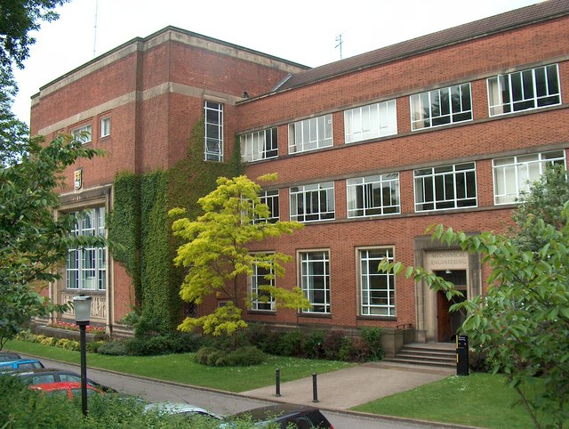
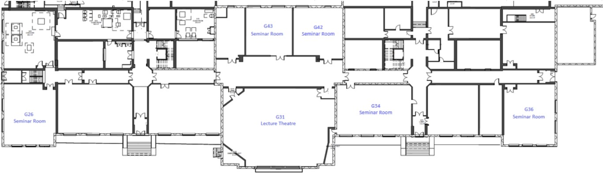

## Conference Venue: Y3, Old Engineering Building, University of Brimingham

> Old School of Engineering, 142 Edgbaston Park Rd, Birmingham B15 2TT

GISRUK 2026 will be held on the University of Birmingham’s campus in Edgbaston. The campus is located approximately 10 minutes by train from Birmingham New Street. The station located on campus is called “University”. The conference will take place on the ground floor of Y3, the former Engineering building.

The Conference Dinner will take place on Thursday evening in the city centre, at The Exchange building. There will be a less formal social event on campus on Wednesday. Details to follow. 

Directions to campus can be found [here](https://www.birmingham.ac.uk/contact/directions/getting-here-edgbaston).
Campus map can be found [here](https://www.birmingham.ac.uk/visit/maps-and-directions).
Edgbaston Park hotel details can be found [here](https://www.edgbastonparkhotel.com/).

## Room Map

<!-- TODO: populate once booked 

##  Dinner Venue: The Faversham

> The Faversham, 1-5 Springfield Mount, LS2 9NG

The conference dinner will be hosted at The Faversham, which is located close to
the University of Leeds.

##  Post-Reception Social Venue: Roxy Ball Room

> Roxy Ball Room, 58 Boar Lane, LS1 6HW

The post-reception social on Wednesday evening will be hosted at Roxy Ball Room
on Boar Lane just a few minutes walk from the conference venue.

##  ECR Social Venue: Parkside Tavern

> Parkside Tavern, Merrion Street, LS2 8JE 

The ECR social on Tuesday evening will be hosted at Parkside Tavern.

##  Other Places...

Beyond the main conference venues outlined above, we have also curated a short
list of other places that visitors to Leeds may enjoy at the end of a conference
day.
These all lie around the city centre and can be seen on the map below.

* **The Bankers Cat:** Located within 5 mins walk of the conference venue and
around the corner from the train station, The Bankers Cat has a lovely selection
of beers and an area with large tables in the basement vault for groups.
* **Tapped:** Just across the road from the Bankers Cat, you will find Tapped
which also serves a great selection of beers as well stone baked pizzas.
* **North Taproom:** If you are looking to sample some of the brilliant beers on
offer from Leeds' local breweries, then North Taproom is a good place to start.
Run by North Brewing, this taproom serves a great selection of beers as well as
street food from Little Bao Boy.
* **The Northern Market:** Previously Assembly Underground (and Carpe Diem
before that), The Northern Market is now a beer hall and food market run by another of Leeds' local breweries - Northern Monk. If you are looking for a stop on your way up towards the conference dinner then this is a good one.
* **Whitelock's Ale House & The Turk's Head:** First opened in 1715, Whitelock's
stakes a claim to being Leeds' oldest pub. Tucked away down an alley off of
Briggate along with its sister pub - The Turk's Head - Whitelock's is a part of
Leeds pub history and serves a selection of real ale and independent craft
beers.
* **Below Stairs:** If beer isn't really your thing and you are looking for
cocktails instead then Below Stairs is a hidden gem. Tucked away on South
Parade, this cocktail bar boasts a unique menu worth checking out.

Other places of interest include:

* **Kirkgate Market:** Located on the East side of the city centre, Kirkgate
  Market is one of largest covered markets in Europe and hosts a range of
  vendors. If you are looking for a place for some food on Friday after the 
  conference then it is worth checking out the market food court.
-->
